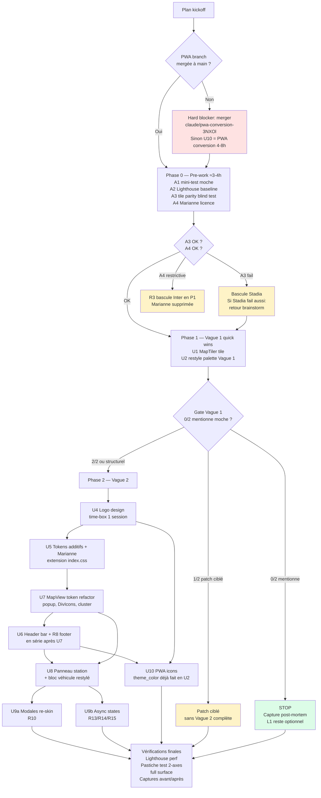

> **Note (2026-04-30, post-livraison)** : direction d'identité pivotée à
> mi-parcours vers du **neutre moderne** (charcoal `#171717` + blanc +
> FUEL_COLORS). MapTiler abandonné (overkill pour le projet). Marianne
> jamais activée. Feature « coût réel » supprimée. Test pastiche et
> disclaimer R8 retirés (non-pertinents pour la nouvelle identité). Ce
> plan reste comme trace de la stratégie initiale ; pour l'état effectif
> du code voir l'historique git de `claude/pwa-conversion-3NXOl`.

# UI redesign — service public moderne (2-wave with gate)

## Overview

Refonte visuelle de l'app `carburants-france` pour passer d'une esthétique Tailwind générique à une identité « service public moderne » (DSFR-inspired) : palette signature ancrée sur le bleu Marianne, typographie Marianne self-hosted, logo + variantes PWA, refonte des écrans clés. La cartographie passe à MapTiler avec labels en français en gardant le rendu épuré actuel.

L'implémentation est **décomposée en 2 vagues avec une gate de validation** entre les deux : la Vague 1 (quick wins low-cost) peut suffire à dissiper le verdict « moche » initial. La Vague 2 (refonte identitaire complète) n'est engagée que si la gate ne passe pas. Un budget hard de **~24h cumulées (incluant Phase 0 ≈ 3-4h)** borne l'effort total.

## Problem Frame

L'app est jugée « moche » par un retour externe (n=1). Le diagnostic identifie 4 causes plausibles : palette générique, écran d'accueil dispersé, labels carte en anglais, typographie par défaut. Sans validation préalable, on ignore laquelle domine, d'où la décomposition en 2 vagues. Le projet est un side-project perso ; le budget temps est explicite (~24h), les tests utilisateurs sont n=2-3 (limite assumée — voir Risk Analysis pour l'impact réel sur la fiabilité du gate).

(see origin: `docs/brainstorms/ui-redesign-service-public-requirements.md`)

## Requirements Trace

- **R1** — Labels carte en français en gardant le rendu visuel actuel (MapTiler positron + `?lang=fr`, Stadia fallback)
- **R2** — Palette signature complète **étendant la palette Vague 1** (bleu Marianne `#000091`, neutres, alerte `#E1000F`, succès `#18753C`, plus nuances de surface et ombres finalisées en U5)
- **R3** — Typographie Marianne 3 poids self-hosted (400/600/700), Inter en fallback runtime
- **R4** — Logo wordmark + pictogramme géométrique abstrait, raster variants
- **R5** — Tokens CSS additifs dans `src/index.css` (extension du `@theme` block existant) avec triage de rollback perf
- **R6** — Vague 1 : restyle modal d'accueil + panneau station (palette Vague 1)
- **R7** — Vague 2 : refonte header sobre avec logo (z-index 1100, hauteur 56px desktop / 48px mobile)
- **R8** — Footer minimal portant le disclaimer anti-pastiche « Site indépendant — non affilié à l'État français »
- **R9** — Refonte panneau station (hero prix, liste secondaire, stale indicator desktop tooltip / mobile inline, **bloc véhicule existant restylé**)
- **R10** — Modales (À propos, Historique) re-skin
- **R11** — Cohérence : tokens appliqués partout y compris `renderPopupHTML`, `createPriceIcon`, `iconCreateFunction` dans `src/components/MapView.tsx`
- **R12** — Zéro régression fonctionnelle. PWA icons régénérées + `theme_color` mis à jour si Vague 2
- **R13** — Search bar : 4 états (typing, results, no-results, error)
- **R14** — Géolocalisation : 3 états (requesting, denied, acquired)
- **R15** — Filtre carburant : pills toggle multi-select avec contraste WCAG AAA

## Scope Boundaries

- ❌ Pas de dark mode
- ❌ Pas de redesign du flow utilisateur (fusion panneau permanent = work item L1, hors scope)
- ❌ Pas de design system formel (Storybook, doc composants)
- ❌ Pas d'illustrations narratives custom, pas de mascot
- ❌ Pas de microinteractions avancées
- ❌ Pas de refonte du pipeline data ou logique métier
- ❌ Pas de migration des PWA installs existantes
- ❌ Pas d'ajout de test runner (Vitest, Playwright). Verification = manuel + Lighthouse + screenshots avant/après. **Mitigation pour R12** : checklist manuelle de régression jointe à chaque PR (cf section Verification Protocol)
- ✅ **In scope, à restyler** : feature « coût d'un plein selon véhicule » (`useVehicleSearch` + `computeRealCost` dans `src/components/StationPanel.tsx`) — pas de redesign d'interaction, juste re-skin

### Deferred to Separate Tasks

- **Fusion panneau permanent (L1)** : extraite du brainstorm, hors budget ~24h. À démarrer post-livraison si l'usage confirme le besoin
- **Pictogramme custom du logo (L2)** : si U4 produit un wordmark seul, le pictogramme abstrait devient un work item séparé
- **Suite des solutions docs (`docs/solutions/`)** : ce projet n'a pas encore adopté la convention compound-engineering. Capturer un post-mortem après chaque vague

## Context & Research

### Relevant Code and Patterns

- **`src/index.css`** (66 lignes) : `@theme` block Tailwind v4 avec `--color-{fuel}` tokens et `--font-sans: 'Inter'`. **Extension additive** dans U5 (pas de rewrite complet — préserver les `--color-{fuel}` consommés via `text-sp95` etc.)
- **`src/components/MapView.tsx`** (multiples surfaces pour R11 et R12) :
  - `createPriceIcon` (L49-75) : `font-family: system-ui...`, `color: white`, dim `#d1d5db`
  - `iconCreateFunction` cluster (L157-200) : même `font-family`, count badge `#374151`
  - `renderPopupHTML` (L371-445) : `font-family: Inter,system-ui,sans-serif`, multiples greys hardcodés, **CTA `#3b82f6`** (collision sémantique avec `--color-sp98`, voir Key Decisions)
  - **`SearchRadiusCircle`** (L474, L477, L487) : `#3b82f6` hardcodé pour le cercle de rayon
  - **Bouton géolocate** (~L588) : `text-blue-500` Tailwind sur le spinner, position `md:right-[300px]`, `bottom-[340px]`, `bottom-16`, `bottom-20`
  - **`<TileLayer>` L563** : URL CARTO `light_all` à remplacer en U1
- **`src/components/SearchBar.tsx`** : `focus:ring-blue-500` (~L88), `bg-blue-50` highlight dropdown (~L119) — à tokeniser
- **`src/components/AboutModal.tsx`** : 3 `text-blue-500` links + `bg-blue-50/text-blue-700` callout (~L59, L63, L67, L74, L90) — à tokeniser
- **`src/components/Header.tsx`** : actuellement un span wordmark de ~5 lignes utilisé inline dans `src/App.tsx`. **Le bar layout (sticky, hauteur, z-index) vit dans App.tsx** (~L197), pas dans Header.tsx. Décision U6 : extraire le bar markup d'App.tsx vers Header.tsx pour en faire un composant self-contained
- **`src/App.tsx`** : footer actuel **inline** (~L292-308) avec liens À propos / Évolution des prix / Données gouv.fr / `meta?.lastUpdate`, conditionnellement masqué en mobile quand une ville est sélectionnée (`hidden md:flex`). U6 doit migrer ce markup vers `src/components/Footer.tsx` en passant `setShowAbout`, `setShowHistory`, `meta` en props et conserver la visibilité conditionnelle mobile
- **`src/components/StationPanel.tsx`** (R9) :
  - `useVehicleSearch` (L40-75) : singleton `vehiclesCache`, lazy-load `vehicles.json`, filtre par `FUEL_TO_VEHICLE_FUEL` (L22-29)
  - `computeRealCost` (L87-101) : calcul coût total (carburant + temps × tarif horaire)
  - Settings state (L104-110) : `realCostMode`, `showSettings`, `tankSize=40`, `consumption=7`, `hourlyRate=15`, `avgSpeed=50`
  - Settings toggle (L203-218) actuellement `bg-blue-50 text-blue-600` à tokeniser
  - Cross-fuel vehicle re-match (L138-160) : non-trivial, à préserver
- **`src/hooks/useCitySearch.ts`** : actuellement, le catch (L94-97) avale toutes les erreurs et set `results: []`. R13 « lien retry » nécessite : (1) distinguer AbortError des autres erreurs, (2) exposer un nouveau champ `error: 'network' | null`, (3) exposer `retry: () => void` qui re-lance la dernière query en bypassant le debounce. Signature additive, pas breaking
- **`index.html`** : `<link>` Inter Google Fonts L27-29 (à retirer en U5), `<meta name="theme-color" content="#3b82f6">` L26 (à passer à `#000091` en U2 OU en U10 — décision : **en U2 pour cohérence du chrome browser dès Vague 1**)
- **`.github/workflows/deploy.yml`** : aucun `env:` actuellement. Ajout du `VITE_MAPTILER_KEY` au **step build uniquement** (pas au job entier) = nouveau pattern. Vérifier que le workflow ne se déclenche pas sur `pull_request` venant de forks (par défaut GitHub protège les secrets dans ce cas sur les repos publics — confirmer avant le premier merge)
- **Conventions implicites** : composants flat dans `src/components/` (PascalCase, named exports), hooks dans `src/hooks/`, utils groupés par concern, pas de barrel `index.ts`, pas de `styles/` directory
- **PAS de tests** : aucun `.test.*` / `.spec.*`, pas de runner. **PAS de lint en CI** (seul `tsc -b && vite build`)

### Institutional Learnings

`docs/solutions/` n'existe pas encore. Aucun apprentissage à retrofitter — on plan sur premiers principes. Capturer un post-mortem après chaque vague pour seeder la convention.

### External References

External research skipped : tech stack bien établi, brainstorm a documenté MapTiler raster URL, Stadia URL, Marianne self-host depuis le site officiel, font-display strategies. Cf brainstorm sections « Pre-work A3 », « R3 », « Dependencies / Assumptions ».

## Key Technical Decisions

- **Branche `claude/pwa-conversion-3NXOl` mergée à `main` AVANT démarrage du plan**. **Hard prerequisite** (pas une assumption). Vérifier l'état avant Phase 0. Si non-mergée : soit la merger d'abord, soit U10 absorbe la conversion PWA initiale (estimer 4-8h, pas 0.5 session — recalibrer le budget en conséquence).
- **Pas de test runner ajouté** dans cette refonte. Vérification = manuel + Lighthouse + screenshots. Mitigation : checklist manuelle de régression jointe à chaque PR (markdown dans `docs/`), screen recording joint au PR de U8 (vehicle feature).
- **`--color-primary` séparé de `--color-sp98`** : la CTA bleue actuelle (`#3b82f6` dans `renderPopupHTML`) est sémantiquement « primary action », pas « SP98 fuel ». U2 introduit `--color-primary` (= `#000091`) distinct.
- **Tokens nommés sémantiquement** : préférer `--color-ink`, `--color-ink-muted` (text), `--color-surface` à `--color-text-primary` (qui générerait l'utilitaire bizarre `bg-text-primary`). Convention Tailwind v4 : `--color-{name}` génère `text-{name}`/`bg-{name}`.
- **Pas de `--font-marianne` token séparé** : après U5, `--font-sans` est déjà `'Marianne', 'Inter', system-ui, sans-serif`. Le consommer via `var(--font-sans)` inline dans les template strings de `MapView.tsx` (popup, DivIcons, cluster) suffit. Pas d'abstraction supplémentaire.
- **U5 est additif, pas big-bang.** Le `@theme` block existant est **étendu** (ajout de tokens), pas réécrit. Préserve les `--color-{fuel}` consommés. Réduit le risque de régression silencieuse en l'absence de tests.
- **U2 modifie déjà `<meta name="theme-color">` à `#000091`**. La PWA `theme_color` dans `manifest.webmanifest` est aussi mise à jour en U2 (pas en U10) pour éviter l'incohérence si la gate stoppe Vague 1. Les icônes PWA elles, restent inchangées tant que U4 n'a pas livré (U10 = icônes uniquement, conditionnel).
- **Vague 1 = palette Vague 1 + Inter.** Évite la dépendance circulaire avec Marianne. Les tokens introduits en U2 (`--color-primary`, `--color-alert`, `--color-success`, `--color-surface`, `--color-ink`, `--color-ink-muted`) sont **conservés** par U5 qui ajoute uniquement les nuances supplémentaires (ombres, rayons, surfaces fines). Pas de throwaway.
- **Logo R4 time-boxé 1 session**. Si débordement → wordmark seul livré. ⚠️ **Note** : le wordmark Marianne Bold sur fond `#000091` est exactement la configuration la plus susceptible de déclencher le test pastiche. Si fallback wordmark seul, **basculer le wordmark sur Inter ou ajuster le bleu en accent (pas en aplat plein écran)** pour casser le signal gouv.fr.
- **PWA icons régen sautée si gate Vague 1 stop** : pas de logo R4 produit. Le `theme_color` reste à `#000091` (déjà appliqué en U2). Acceptable : chrome browser cohérent, icônes PWA = identité antérieure (visible uniquement pour les utilisateurs déjà installés).
- **U6 et U7 sérialisés (pas parallèles)** : tous deux modifient `src/components/MapView.tsx`. Ordre recommandé : U7 (token refactor des popups/DivIcons/cluster) **avant** U6 (header), pour que la vérification de U6 (popups apparaissent en-dessous du header sticky) se fasse contre l'état tokenisé final.
- **U9 splitté en U9a (modales) + U9b (async states)** : U9a est un re-skin pur (~30 min), U9b porte les changements behavior (R13/R14/R15). Permet de shipper U9a tôt et d'isoler le risque de U9b.

## Open Questions

### Resolved During Planning

- **PWA branche dépendance** : promue en hard prerequisite. Vérifier l'état avant Phase 0.
- **`--color-primary` vs `--color-sp98`** : token séparé sémantique distinct.
- **`--font-marianne` token** : abandonné. `var(--font-sans)` suffit.
- **Test runner** : pas ajouté. Mitigation = checklist manuelle + screen recording PR U8.
- **U5 stratégie** : additive, pas big-bang.
- **`theme_color` PWA timing** : U2 (cohérence dès Vague 1).
- **Header.tsx vs App.tsx bar layout** : extraire le bar markup d'App.tsx vers Header.tsx en U6.
- **Footer.tsx** : migrer le footer inline d'App.tsx (avec props pour state).
- **U6 / U7 ordering** : sérialisé, U7 avant U6.
- **Wordmark fallback** : si U4 produit wordmark seul, basculer Inter ou ajuster le bleu (pas Marianne+aplat#000091).

### Deferred to Implementation

- **[Non-blocking]** Conception du pictogramme du logo (R4) — direction concept, choix d'outil. Time-box 1 session.
- **[Non-blocking]** Détail final des tokens CSS additionnels (ombres, rayons) — au moment de U5.
- **[Non-blocking]** Mesure LCP réelle Marianne 3 poids vs Inter — staging avant merge U5.
- **[Non-blocking]** Comportement back-nav du panneau station mobile : **default = bouton X visible top-right, min touch target 44x44px**. Swipe-down = stretch goal, sinon L3.
- **[Non-blocking]** Détail des templates HTML de popup post-restyle — sémantique inchangée, tokenisation seulement.
- **[Non-blocking]** Si gate Vague 1 stop : capture post-mortem dans `docs/solutions/`.

## High-Level Technical Design

> *Ce diagramme illustre la séquence à haut niveau (Vague 0 → 1 → gate → 2 conditionnel) et les dépendances clés entre unités. C'est une guidance directionnelle pour la review, pas une spécification d'implémentation.*

**Lecture rapide :**
- Phase 0 = validations préalables, **comptées dans le budget ~24h**
- Phase 1 = 2 unités de code (U1 + U2) + Gate (validation, non-code)
- Phase 2 = 8 unités (U4-U10 dont U9a/U9b), conditionnelles
- U4 (logo) bloque U6 (header) et U10 (PWA icons)
- U5 bloque U7-U9 ; U7 et U6 sérialisés (collision MapView.tsx) ; U8 dépend de U6+U7

## Phased Delivery

### Phase 0 — Pre-work (≈3-4h, in budget)

A1-A4 du brainstorm. Ces actions ne sont pas des unités de code mais des validations bloquantes. **Décompte budget** : A1 ≈ 1-1.5h (recruter 2 testeurs + interview structurée), A2 ≈ 0.25h, A3 ≈ 1-1.5h (captures sur 4 zooms en aveugle), A4 ≈ 0.5h. Total ≈ 3-4h.

- **A1** : Mini-test « moche » à 2 personnes (n=2 limite assumée — voir Risk Analysis). Question ouverte unique : « qu'est-ce qui te frappe comme moche en premier ? ». Trier les premières mentions en 3 axes : *structure* / *identité* / *contenu*. **Seuil indicatif** : si <40% identité (sur 4-6 mentions agrégées) → reconsidérer la priorisation Vague 2. Ce seuil est une indication, pas une règle automatique ; le décideur tranche en documentant son raisonnement.
- **A2** : Lighthouse Performance baseline mobile + desktop sur la version actuellement déployée. Inscrire les valeurs dans le planning. Tolérance R12 = −5 points cumulés.
- **A3** : Test parité tile en aveugle. Captures CARTO `light_all` vs MapTiler `positron` raster + `?lang=fr` aux zooms 5/8/12/16. **Protocole anti-biais** : tierce personne labellise A/B en ordre aléatoire. Critère : si l'auteur identifie correctement >70% sur 6 essais → MapTiler diffère perceptiblement, fallback Stadia. Si Stadia échoue aussi → retour brainstorm.
  - URL exacte MapTiler : `https://api.maptiler.com/maps/positron/{z}/{x}/{y}.png?key=${VITE_MAPTILER_KEY}&lang=fr` (sans `{s}`)
  - URL exacte Stadia : `https://tiles.stadiamaps.com/tiles/alidade_smooth/{z}/{x}/{y}.png?api_key=${VITE_STADIA_KEY}`
- **A4** : Lecture licence Marianne (Etalab 2.0). **Critères évalués** : (1) usage commercial OK ?, (2) clauses pastiche/identity ?, (3) attribution requise ?, (4) restriction format de fichier ?, (5) combinaison avec autres polices ?. Si une de ces réponses est restrictive pour un side-project → R3 bascule Inter avant tout code U5.

### Phase 1 — Vague 1 (Quick wins)

U1 + U2 (code) + Gate (validation, non-code, comptée comme U3 dans la checklist pour traçabilité).

### Phase 2 — Vague 2 (Refonte identitaire complète, conditionnelle)

U4 → U5 → U7 → U6 → U8 → (U9a + U9b en parallèle si capacité) → U10. Démarre seulement si la Gate ne passe pas. **Note** : U6 et U7 ont été inversés vs version précédente du plan — U7 d'abord (refactor MapView popup/DivIcons), U6 ensuite (header bar) en série pour éviter les collisions de merge sur `src/components/MapView.tsx`.

## Implementation Units

> **Note de checklist** : U1, U2, U3 (Gate) sont les unités inconditionnelles de Vague 1. U4-U10 sont conditionnelles à la sortie de la Gate (déclenchées seulement si « 2/2 mentionne moche » ou point structurel).

- [ ] **Unit 1: MapTiler tile integration**

**Goal:** Remplacer le `<TileLayer>` CARTO par MapTiler positron raster avec `?lang=fr`. Configurer le secret CI et la restriction Referrer.

**Requirements:** R1

**Dependencies:** Phase 0 A3 (validation MapTiler ou Stadia)

**Files:**
- Modify: `src/components/MapView.tsx` (~L563, `<TileLayer url=...>`)
- Modify: `.github/workflows/deploy.yml` (env: au step build uniquement)
- Create: `.env.example` (documenter `VITE_MAPTILER_KEY`)
- Modify: `.gitignore` si `.env.local` n'est pas déjà ignoré (vérifier d'abord — souvent par défaut)
- Modify: `CLAUDE.md` ou créer une section dans `README.md` (setup local de la clé)

**Approach:**
- URL MapTiler : `https://api.maptiler.com/maps/positron/{z}/{x}/{y}.png?key=${import.meta.env.VITE_MAPTILER_KEY}&lang=fr`
- Attribution : conserver `OpenStreetMap` + ajouter `MapTiler` (ou `Stadia` selon A3)
- Restriction MapTiler par HTTP Referrer (allow-list `*.github.io/carburants-france/*`) + **hard quota cap** côté dashboard (pas juste alerte) pour faire un fail dur en cas d'abus plutôt qu'un dépassement de billing
- Workflow : `env: VITE_MAPTILER_KEY: ${{ secrets.MAPTILER_KEY }}` au **step Build uniquement** (pas au job entier). Confirmer que le workflow ne se déclenche pas sur `pull_request` venant de forks
- **Permission scope minimal** côté MapTiler : tile access uniquement, pas geocoding/data API
- **Fallback runtime CARTO sur 4xx** : ajouter un handler d'erreur `tileerror` sur le `<TileLayer>` qui bascule vers `https://{s}.basemaps.cartocdn.com/light_all/{z}/{x}/{y}{r}.png` (zéro clé requise) si MapTiler retourne 401/403/429. Évite le map-blanc en cas de quota épuisé. Note : ce fallback affiche les labels EN, mais c'est mieux que rien

**Patterns to follow:**
- `<TileLayer>` API react-leaflet déjà utilisée. Conserver la prop interface

**Test scenarios:**
- *Test expectation: none — pure config + URL substitution. Vérification manuelle.*

**Verification:**
- En dev local avec `.env.local` : carte affiche tuiles MapTiler, labels FR aux zooms 5/8/12/16
- En prod avec secret configuré : même check après deploy
- Test négatif : clé invalide → fallback CARTO actif (pas de map blanche)
- DevTools Network : requêtes vers `api.maptiler.com` avec `lang=fr`
- Vérifier la quota dashboard MapTiler après 24h : pas de spike anormal

---

- [ ] **Unit 2: Vague 1 restyle (palette Vague 1, Inter, theme_color PWA)**

**Goal:** Appliquer la palette Vague 1 (`#000091`, `#E1000F`, `#18753C`, neutres) avec Inter sur le modal d'accueil, le panneau station, le header, les modales (À propos), la search bar, et les surfaces inline de MapView.tsx. Mettre à jour `theme_color` PWA pour cohérence chrome browser.

**Requirements:** R6, R7-light (Vague 1)

**Dependencies:** U1 livré (chronologiquement, pour éviter conflits sur `MapView.tsx`)

**Files:**
- Modify: `src/index.css` (ajouter tokens dans le `@theme` block existant, **additif** : `--color-primary: #000091`, `--color-alert: #E1000F`, `--color-success: #18753C`, `--color-surface: #F5F5FE`, `--color-ink: #3A3A3A`, `--color-ink-muted: #666`)
- Modify: `src/App.tsx` (modal d'accueil : remplacer `bg-blue-*`, `text-blue-*`)
- Modify: `src/components/Header.tsx` (couleurs et accents — bar layout reste en App.tsx pour Vague 1)
- Modify: `src/components/StationPanel.tsx` (settings toggle button : `bg-blue-50 text-blue-600` → `bg-primary` etc.)
- Modify: `src/components/SearchBar.tsx` (`focus:ring-blue-500`, `bg-blue-50` highlight)
- Modify: `src/components/AboutModal.tsx` (3 `text-blue-500` links + `bg-blue-50/text-blue-700` callout)
- Modify: `src/components/MapView.tsx` :
  - `renderPopupHTML` CTA Itinéraire `#3b82f6` → `var(--color-primary)`
  - `SearchRadiusCircle` (~L474, L477, L487) `#3b82f6` → `var(--color-primary)`
  - Bouton géolocate spinner `text-blue-500` → `text-primary`
  - **Note** : les autres greys de `renderPopupHTML` et `createPriceIcon`/`iconCreateFunction` sont touchés en U7, pas en U2. Si Vague 1 ship standalone (gate stop), le popup conserve ses greys hardcodés — acceptable
- Modify: `index.html` (`<meta name="theme-color">` → `#000091`)
- Modify: `public/manifest.webmanifest` (`theme_color: "#000091"` — la PWA branche est merged en pré-requis donc le manifest existe)

**Approach:**
- Étendre le `@theme` block (additif, conserver les `--color-{fuel}` existants)
- Inter reste la typo (déjà chargée via Google Fonts) — pas encore Marianne
- `--color-{fuel}` inchangés : système de wayfinding sur la carte préservé

**Patterns to follow:**
- Les `--color-{fuel}` existants génèrent les utilitaires `text-sp95` etc. Les nouveaux tokens (`--color-primary`, `--color-ink`...) génèrent `text-primary`, `text-ink` de la même façon

**Test scenarios:**
- *Test expectation: none — restyle purement visuel.*

**Verification:**
- Captures avant/après côte à côte sur 5 surfaces : modal d'accueil, panneau station (settings open), popup marqueur, modale À propos, header
- Aucun `text-blue-`, `bg-blue-`, `border-blue-`, `ring-blue-` résiduel : `grep -rn "blue-" src/`
- Aucun `#3b82f6` résiduel : `grep -rn "#3b82f6" src/`
- DevTools Application > Manifest : `theme_color` = `#000091`
- Sur Android Chrome : barre browser au lancement = `#000091`
- App fonctionne en local : recherche, géoloc, sélection station, filtre carburant, modale historique

---

- [ ] **Unit 3: Gate Vague 1 → Vague 2 (validation manuelle)**

**Goal:** Décider si Vague 1 a suffi ou s'il faut engager Vague 2.

**Requirements:** Critère succès « Gate Vague 1 »

**Dependencies:** U1 + U2 livrés et déployés (ou en preview)

**Files:** Aucun. Activité hors-code.

**Approach:**
- Montrer le résultat à 2 personnes (idéalement non recouvrantes avec A1)
- Question ouverte unique : « qu'est-ce que tu remarques en premier ? »
- ⚠️ **Limites du gate à n=2 acknowledgées** : faux STOP plausible sur biais de complaisance. Décision quand-même portée par le décideur après collecte des retours, pas mécaniquement
- Décision :
  - **0/2 mentionne « moche »** dans 3 premiers commentaires spontanés → STOP, on garde Vague 1. Capturer post-mortem dans `docs/solutions/`
  - **1/2 mentionne un point résoluble sans Vague 2 complète** (lisibilité prix, marqueur précis, micro-bug) → patch ciblé, pas de Vague 2 full. Le patch est documenté en commit message + ajouté au plan comme U2-bis
  - **2/2 ou point structurel persistant** → engager Vague 2

**Test scenarios:**
- *Test expectation: none — acte de décision, pas de code.*

**Verification:**
- Note écrite (commit ou PR) : qui a testé, leurs commentaires verbatim, décision (stop / patch / Vague 2)
- Si Vague 2 : démarrer U4. Si stop ou patch : créer issue de suivi pour L1 (fusion panneau permanent) si verdict mitigé sur la structure

---

- [ ] **Unit 4: Logo design (time-box 1 session)**

**Goal:** Concevoir le logo (wordmark + pictogramme géométrique abstrait) et exporter les variantes raster nécessaires.

**Requirements:** R4

**Dependencies:** Aucune dépendance code. Bloque U6, U10.

**Files:**
- Create: `public/logo.svg` (logo source)
- Replace: `public/favicon.ico`, `public/favicon.svg`, `public/apple-touch-icon-180x180.png`
- Replace icônes manifest : `public/pwa-64x64.png`, `public/pwa-192x192.png`, `public/pwa-512x512.png`, `public/maskable-icon-512x512.png` (4 variantes listées dans `manifest.webmanifest`)

**Approach:**
- Outil : Figma / Affinity / AI-assisted gen
- Direction : pictogramme abstrait (pas de pompe à essence littérale, pas de mascot)
- Pistes : hexagone stylisé / forme abstraite type graphique de prix / point géoloc stylisé
- Wordmark Marianne Bold en SVG (pas de dépendance fonts runtime)
- **Time-box 1 session (~6h)**. Si débordement → **wordmark seul en Inter** (pas Marianne pour casser le signal pastiche). Le pictogramme custom devient L2.
- Export raster via outil de design (Figma export ou online tool comme `maskable.app` + `sharp` CLI). **Pas de `vite-plugin-pwa-assets-generator`** (jamais installé dans ce projet).

**Test scenarios:**
- *Test expectation: none — production design.*

**Verification:**
- 8 fichiers (1 SVG source + 7 variantes raster) dans `public/`. **Détail** : 4 PNG dans le manifest (`pwa-64`, `pwa-192`, `pwa-512`, `maskable-512`), `apple-touch-icon-180x180.png` référencée dans `index.html`, `favicon.ico` + `favicon.svg` pour l'onglet browser
- SVG lisible à 16px (favicon)
- Test pastiche partiel sur le header mockup à 3 personnes : « est-ce que tu penses que c'est un site officiel ? » + « est-ce que tu fais confiance pour des prix à jour ? » (2 axes). Si ≥1/3 répond « oui » au premier, ajustements

---

- [ ] **Unit 5: Tokens additifs + Marianne self-host**

**Goal:** Étendre `src/index.css` avec les tokens additionnels + Marianne self-hosted + l'échelle typographique. Retirer Inter de Google Fonts.

**Requirements:** R2, R3, R5

**Dependencies:** Phase 0 A4 validée (Marianne licence OK) ; sinon ce unit pivote sur Inter self-host.

**Files:**
- Modify: `src/index.css` (**extension additive** du `@theme` block — pas rewrite. Ajout des `@font-face` Marianne, ajout tokens nuancés ombres/rayons. Conservation totale des `--color-{fuel}` + tokens U2 + `.glass` + `.panel-scroll` + `.marker-cluster-*`)
- Create: `public/fonts/Marianne-Regular.woff2` (téléchargé directement depuis `https://www.systeme-de-design.gouv.fr/fondamentaux/typographie/`. **Vérifier SHA-256** contre les checksums publiés sur le repo DSFR avant commit)
- Create: `public/fonts/Marianne-SemiBold.woff2` (idem)
- Create: `public/fonts/Marianne-Bold.woff2` (idem)
- Modify: `index.html` (retirer les 3 lignes `<link>` Inter Google Fonts L27-29 ; ajouter `<link rel="preload" as="font" href="/carburants-france/fonts/Marianne-Regular.woff2" type="font/woff2" crossorigin>`)

**Approach:**
- `@theme` extension : `--font-sans: 'Marianne', 'Inter', system-ui, sans-serif`. `@font-face` self-hosted dans `index.css` avec `font-display: swap`
- Échelle typo (commentaire CSS) : Hero 2rem/700+tabular, Title 1.125rem/600, Body 1rem/400, Data 0.875rem/400+tabular, Microcopy 0.75rem/400
- **Triage de rollback** si Lighthouse Performance régresse > 5 points (mesure intermédiaire obligatoire sur staging avant merge) :
  1. Retirer le `<link rel=preload>`
  2. Basculer `--font-sans` vers Inter et self-host Inter à la place de Marianne
  3. Revert tokens partiel sur les écrans non-critiques

**Patterns to follow:**
- Le `@theme` block actuel (pré-extension) est l'exemple. Garder la syntaxe Tailwind v4
- Self-host fonts via `public/fonts/` cohérent avec `base: '/carburants-france/'`

**Test scenarios:**
- *Test expectation: none — refonte tokens, vérification perf + visuelle.*

**Verification:**
- Lighthouse Performance mobile + desktop sur staging : ≥ baseline A2 −5 points
- Captures avant/après sur 3 écrans
- DevTools Network : Marianne charge en `font-display: swap`, preload Regular 400 effectif
- Aucune référence Google Fonts (`grep -rn "fonts.google" .`)
- Tabular-nums effectif sur les prix (visuellement aligné)
- SHA-256 des 3 .woff2 vérifiés

---

- [ ] **Unit 7: MapView token refactor (popup, DivIcons, cluster)**

**Goal:** Tokeniser les surfaces inline HTML restantes dans `src/components/MapView.tsx` (greys + fonts) après U2 a déjà fait les bleus.

**Requirements:** R11

**Dependencies:** U5 (tokens disponibles). **Sérialisé avant U6** pour éviter collision MapView.tsx.

**Files:**
- Modify: `src/components/MapView.tsx` (3 fonctions : `createPriceIcon` L49-75, `iconCreateFunction` L157-200, `renderPopupHTML` L371-445 — uniquement les greys et fonts ; les bleus ont été touchés en U2)

**Approach:**
- Remplacer les hex greys hardcodés par les tokens : `#374151`/`#111827`/`#1f2937` → `var(--color-ink)`, `#9ca3af`/`#6b7280`/`#d1d5db` → `var(--color-ink-muted)` ou un neutre dédié, `#f3f4f6` → token de surface
- Remplacer `font-family: system-ui, -apple-system, sans-serif` (price icons + cluster) et `font-family: Inter,system-ui,sans-serif` (popup) par `font-family: var(--font-sans)`. **Pas besoin de `--font-marianne` séparé** : `--font-sans` est déjà la stack `Marianne, Inter, system-ui` après U5
- **Ne PAS toucher aux `FUEL_COLORS[fuel]`** (wayfinding cartographique préservé)
- Structure DOM identique. Seules les déclarations inline changent

**Patterns to follow:**
- `var(--color-X)` inline dans template strings : pratique web standard, popups Leaflet héritent des CSS vars du `:root`

**Test scenarios:**
- *Test expectation: none — restyle pur.*

**Verification:**
- Test visuel : popup, marker icon, cluster icon affichent les nouvelles couleurs/fonts
- `grep -n "#[0-9a-fA-F]\{6\}" src/components/MapView.tsx` : seuls les FUEL_COLORS via `getPriceColor` restent
- `grep -n "font-family:" src/components/MapView.tsx` : uniquement `var(--font-sans)` ou `system-ui` final (fallback)

---

- [ ] **Unit 6: Header bar + R8 footer disclaimer**

**Goal:** Extraire le bar markup d'`App.tsx` vers `Header.tsx` comme composant self-contained avec logo + wordmark, hauteur 56px desktop / 48px mobile, sticky z-index 1100. Migrer le footer inline d'`App.tsx` vers `Footer.tsx` avec disclaimer anti-pastiche.

**Requirements:** R7, R8

**Dependencies:** U4 (logo), U5 (tokens), U7 (MapView tokenisé pour cohérence). Sérialisé après U7.

**Files:**
- Modify: `src/components/Header.tsx` (extraire le markup actuel d'App.tsx ~L197 vers ce composant ; intégrer logo `public/logo.svg`, hauteur, sticky z-index 1100)
- Create: `src/components/Footer.tsx` (composant qui prend `setShowAbout`, `setShowHistory`, `meta` en props ; reproduit les liens existants À propos / Évolution / Données gouv.fr / `lastUpdate` ; ajoute le disclaimer R8)
- Modify: `src/App.tsx` (remplacer le bar inline par `<Header>` ; remplacer le footer inline ~L292-308 par `<Footer ... />`. **Conserver la visibilité conditionnelle mobile** : `hidden md:flex` quand une ville est sélectionnée — décision : le footer reste hidden en mobile sur city selected, mais le disclaimer s'affiche. Si conflit, prioriser : disclaimer toujours visible, autres liens hidden md:flex)
- Modify: `src/components/MapView.tsx` (vérifier offsets bouton géolocate `md:right-[300px]`, `bottom-[340px]`, `bottom-16`, `bottom-20` après changement hauteur header — sinon ajuster. Spinner accessible : voir A11y section)

**Approach:**
- Header : `position: sticky; top: 0; z-index: 1100`. Stack Leaflet : 400/700/800. Header au-dessus
- Hauteur : `h-14` desktop, `h-12` mobile via responsive Tailwind
- Footer : compact, microcopy gris, hiérarchie typo. Disclaimer R8 = ligne unique « Site indépendant — non affilié à l'État français »
- Inclure un **skip-nav link** (visually hidden, visible on focus) en premier élément focusable du DOM, pointant sur la search bar ou le main landmark. WCAG 2.4.1 Level A
- Landmark roles : `<header role="banner">`, `<main role="main">` autour de la map, `<footer role="contentinfo">`. (Optionnel mais recommandé.)

**Patterns to follow:**
- Le composant `Header` actuel suit la convention flat. Le nouveau `Footer` également.

**Test scenarios:**
- *Test expectation: none — restyle visuel + extraction de markup. Smoke test : tous les boutons existants déclenchent les bonnes actions.*

**Verification:**
- Captures avant/après header (desktop + mobile)
- DevTools : `z-index: 1100` sur header, popups Leaflet en-dessous (test : ouvrir popup proche du haut de la carte)
- Bouton géolocate cliquable et bien positionné (mobile + desktop)
- Footer disclaimer affiché
- Skip-nav link : Tab depuis le top de la page → premier focus visible « Aller à la recherche »
- Test pastiche post-livraison U6 (n=3, 2 axes : trust 1-5 + officialité oui/non)
- Tous les flows existants fonctionnent : ouvrir À propos, ouvrir Historique, sélectionner ville, sélectionner station

---

- [ ] **Unit 8: Panneau station refonte (R9 + bloc véhicule restylé)**

**Goal:** Implémenter la hiérarchie type fiche d'identité (hero prix + liste secondaire + métadonnées + stale indicator) avec préservation et re-skin du bloc véhicule existant.

**Requirements:** R9

**Dependencies:** U6 (header en place pour cohérence visuelle), U7 (MapView tokenisé)

**Files:**
- Modify: `src/components/StationPanel.tsx` (refonte mise en page + re-skin bloc véhicule **sans** toucher logique `useVehicleSearch` / `computeRealCost`)

**Approach:**
- **Hero** : prix carburant filtré (ou cheapest si aucun filtre), 2rem / 700 / `tabular-nums`. Si filtre actif non vendu → afficher cheapest avec « Ce carburant n'est pas vendu ici »
- **Liste secondaire** : autres carburants vendus, tabular-nums. **Si station ne vend qu'un seul carburant → liste secondaire entièrement masquée** (pas d'empty state)
- **Métadonnées** : nom · marque · adresse · « MAJ il y a X »
- **Stale indicator** (>72h) : prix gris + pictogramme warning. **Desktop** : tooltip on hover **AND focus** (icon `tabindex=0`, `aria-describedby`). **Mobile** : microcopy inline « Données non rafraîchies depuis Xh » sous le prix (pas de tooltip — hover absent)
- **Bloc véhicule (in scope, restylé seulement)** :
  - Settings toggle button : tokens `--color-primary`
  - Settings panel collapsible : palette + typo cohérentes
  - Autocomplete véhicule : dropdown avec **même style que U9b search dropdown** (max-height 240px, dismiss Escape/click-outside, kbd nav avec ARIA combobox/listbox — voir A11y section)
  - Coût réel : tabular-nums
  - **AUCUN changement** à `useVehicleSearch`, `computeRealCost`, ni à la logique cross-fuel re-match (L138-160)
- Back-nav mobile : **bouton X visible top-right (44x44px min touch target)**. Swipe-down stretch goal (sinon L3)

**Patterns to follow:**
- `tabular-nums` via `font-variant-numeric: tabular-nums`
- FUEL_COLORS consommés via utilitaires existants

**Test scenarios:**
- Happy path — Sélection station 4 carburants : hero affiche filtre actif, liste secondaire affiche les 3 autres alignés
- Edge case — Station 1 carburant : liste secondaire entièrement masquée
- Edge case — Filtre actif non vendu : hero affiche cheapest + texte « Ce carburant n'est pas vendu ici »
- Edge case — `lastUpdate` > 72h : prix gris + warning. Desktop hover **OR** focus → tooltip. Mobile : microcopy inline
- Integration — Toggle « Coût réel » : tri stations selon coût total (carburant + temps × tarif horaire)
- Integration — Sélection véhicule via autocomplete : conso et tank mis à jour, coût réel recalculé
- Integration — Changement carburant (filtre fuel) : cross-fuel re-match L138-160 fonctionne (véhicule actif reste pertinent ou est remplacé)

**Verification:**
- Captures avant/après sur 3 cas : station 4 carburants, station 1 carburant, station données stales
- Bloc véhicule fonctionne identiquement : test manuel des 3 scénarios d'intégration ci-dessus
- Aucune réécriture de `useVehicleSearch` ni `computeRealCost` (diff ligne à ligne)
- **Screen recording joint au PR** exerçant les 3 scénarios d'intégration ; checklist de régression cochée

---

- [ ] **Unit 9a: Modales re-skin (R10)**

**Goal:** Re-skin des modales (À propos, Historique des prix) avec nouvelle palette + typo. Aucun changement structurel ni comportemental.

**Requirements:** R10

**Dependencies:** U5 (tokens)

**Files:**
- Modify: `src/components/AboutModal.tsx`
- Modify: `src/components/PriceHistoryModal.tsx`

**Approach:**
- Tokens R5 + Marianne. Structure inchangée, contenu informationnel inchangé
- **Focus management** (a11y) : sur open, focus déplacé vers le container modal (`role="dialog"` + `aria-modal="true"` + `aria-labelledby`). Sur close (Escape ou bouton X), focus retourne à l'élément déclencheur

**Test scenarios:**
- *Test expectation: none — restyle pur.*

**Verification:**
- Captures avant/après pour chaque modale
- Focus management : ouvrir modale, vérifier focus dans le dialog ; Escape ferme et focus retourne au déclencheur

---

- [ ] **Unit 9b: Async states (R13 search, R14 geoloc, R15 fuel filter)**

**Goal:** Implémenter les états async pour search bar, géolocalisation et filtres carburant avec ARIA et keyboard navigation.

**Requirements:** R13, R14, R15

**Dependencies:** U5 (tokens). Indépendant de U9a.

**Files:**
- Modify: `src/components/SearchBar.tsx` (4 états + dropdown ARIA combobox/listbox)
- Modify: `src/hooks/useCitySearch.ts` (extension additive : retour `{ ..., error: 'network' | null, retry: () => void }` ; distinguer AbortError des erreurs réseau dans le catch ; `retry()` appelle `search(query)` en bypassant le debounce)
- Modify: `src/components/MapView.tsx` (bouton géolocate : 3 états + `aria-label` updates)
- Modify: `src/components/FuelFilter.tsx` (pills toggle multi-select avec `aria-pressed` + `role="group"`)

**Approach:**
- **R13 search bar** :
  - Dropdown : `max-height: 240px`, `overflow-y: auto`, dismiss Escape/click-outside, kbd nav (flèches + Enter), `z-index: 1100`
  - **ARIA combobox pattern** : input `role="combobox"`, `aria-expanded`, `aria-controls=listboxId`, `aria-activedescendant=optionId`. UL `role="listbox"`. Chaque LI `role="option"` + id. No-results et error annoncés via `aria-live="polite"` ou `role="status"`
  - Loading : input + spinner discret
  - No-results : « Aucune ville trouvée » microcopy
  - API error : « Erreur réseau » + **bouton** `Réessayer` (pas un lien). Après click, focus retourne à l'input
- **R14 géolocalisation** :
  - Requesting : bouton avec spinner + texte « Localisation… ». **`aria-label` mise à jour par état** : 'Localiser ma position' / 'Localisation en cours' / retour idle
  - Permission denied : message fallback « Autorisation refusée — tapez une ville ci-dessus » sous l'input search, **`role="alert"`** pour annonce screen reader sans focus
  - Position acquired : silent flyTo
- **R15 filtre carburant** :
  - Pills `<button>` avec `aria-pressed=true/false`. Groupe `role="group"` + `aria-label="Filtrer par carburant"`. Space/Enter togglent. Tab navigue
  - État actif : remplissage `--color-primary`, **texte blanc `#FFFFFF`** (contraste AAA validé)
  - État inactif : outline gris + dot accent FUEL_COLORS **`aria-hidden="true"`** (décoratif)
  - Mobile : pills wrap multi-lignes (pas de scroll horizontal)
  - Tous désactivés → « show all » (comportement actuel)

**Patterns to follow:**
- AriaCombobox standard : voir [WAI-ARIA Authoring Practices](https://www.w3.org/WAI/ARIA/apg/patterns/combobox/) — pas besoin d'implémenter au-delà du minimum (l'app n'a pas de tests a11y automatisés, viser la conformance fonctionnelle)
- Vehicle autocomplete dans U8 utilise le même pattern combobox/listbox

**Test scenarios:**
- Happy path — Saisie >3 chars : spinner, dropdown avec résultats
- Edge case — Saisie sans match : « Aucune ville trouvée »
- Edge case — Escape : dropdown disparaît, focus reste input
- Edge case — Click-outside : dropdown disparaît
- Edge case — Flèche bas + Enter : 1ère ville sélectionnée + flyTo
- Error path — Désactiver réseau : « Erreur réseau » + bouton Réessayer. Click retry → ré-émission. Focus retour input
- Happy path — Géolocate accordée : spinner 1-2s, flyTo silencieux
- Error path — Géolocate refusée : message `role="alert"` sous search, bouton retour idle
- Happy path — Toggle pills : marqueurs s'affichent/masquent ; texte blanc sur `#000091`
- Edge case — Tous pills off : « show all »
- Edge case — Mobile étroit : pills wrappent, pas de scroll horizontal
- A11y — Screen reader (NVDA ou VoiceOver) : combobox annonce les résultats lors de la nav clavier ; alert message annoncé ; pills annoncées avec leur `aria-pressed`

**Verification:**
- Tester chaque état listé ci-dessus
- DevTools accessibility tree : combobox pattern correct, alerts annoncés
- WebAIM Contrast Checker : blanc sur `#000091` ≥ 7:1
- Test manuel screen reader sur 1 flow (au moins) : recherche ville complète

---

- [ ] **Unit 10: PWA icons regen**

**Goal:** Régénérer les icônes PWA en variantes du nouveau logo. **Le `theme_color` est déjà fait en U2.**

**Requirements:** R12 (partie icônes)

**Dependencies:** U4 (logo livré). **Sauté si gate Vague 1 stop**.

**Files:**
- Replace: `public/pwa-64x64.png`, `public/pwa-192x192.png`, `public/pwa-512x512.png`, `public/maskable-icon-512x512.png` (4 variantes listées dans `manifest.webmanifest`)
- Replace: `public/apple-touch-icon-180x180.png` (référencée dans `index.html` via `<link rel="apple-touch-icon">`)
- Replace: `public/favicon.ico`, `public/favicon.svg` (onglet browser)

**Approach:**
- Si U4 a livré 7 variantes raster, copier-replacer
- Si U4 a livré seulement le SVG : génération via Figma export ou outil online (`maskable.app` + `sharp` CLI). Pas de `vite-plugin-pwa-assets-generator` (jamais installé)
- **Acknowledged** : utilisateurs PWA déjà installés gardent ancienne icône en cache. Acceptable.

**Test scenarios:**
- *Test expectation: none — replacement de fichiers.*

**Verification:**
- DevTools Application > Manifest : 4 PNG en preview, `theme_color` `#000091` (déjà appliqué U2)
- Android Chrome : « Ajouter à l'écran d'accueil » utilise la nouvelle icône
- iOS Safari : apple-touch-icon mis à jour
- Onglet browser : favicon mis à jour

## Accessibility (a11y) Cross-Cutting Requirements

Les exigences a11y sont distribuées par unit ci-dessus. Récap consolidé pour audit final :

- **Modales (U9a)** : `role="dialog"` + `aria-modal="true"` + `aria-labelledby` + focus management open/close
- **Search bar dropdown (U9b)** : ARIA combobox pattern (combobox + listbox + option + activedescendant) + `aria-live` pour no-results/error
- **Vehicle autocomplete (U8)** : même pattern ARIA combobox que search bar
- **Géolocate button (U9b)** : `aria-label` updates par état, message denied en `role="alert"`
- **Fuel pills (U9b)** : `<button>` + `aria-pressed`, groupe `role="group"` + `aria-label`. Dot décoratif `aria-hidden`
- **Stale tooltip (U8)** : `tabindex=0` sur l'icône warning + `aria-describedby` sur le tooltip. Hover **AND** focus
- **Header (U6)** : skip-nav link visible-on-focus en premier élément focusable, landmark roles (`banner`, `main`, `complementary`, `contentinfo`)
- **Retry button (U9b)** : `<button>`, pas `<a>`. Label `Réessayer`. Focus retour input après click
- **Stale icon (U8)** : alt text / `aria-label` pour le pictogramme warning (pas purement décoratif puisqu'il porte l'info « stale »)

## Verification Protocol (compense l'absence de test runner)

Pour chaque PR de Vague 2, joindre :
1. **Captures avant/après** des écrans modifiés
2. **Lighthouse Performance mobile + desktop** post-changement (comparé à A2 baseline)
3. **Checklist manuelle de régression** (markdown dans `docs/regression-checklist-ui-redesign.md` à créer en U1) : flows search, géoloc, sélection station, filtre carburant, modale historique, install PWA, vehicle real-cost
4. **Pour U8** : screen recording joint au PR, exerçant les 3 scénarios d'intégration vehicle feature

Pour la **vérification finale post-Vague 2** (ou post-patch), test pastiche full-surface :
- N=3 testeurs (idéalement non recouvrants avec A1 et la gate U3)
- Surface complète : home modal, panneau station, popup marqueur, modale historique, install PWA
- 2 axes : trust (1-5, requis ≥4) ET officialité (oui/non, requis non/pas-sûr)
- Win zone : trust ≥4 ET officialité ≠ oui pour ≥2/3 testeurs

## System-Wide Impact

- **Interaction graph** :
  - `MapView.tsx` touché par U1 (TileLayer), U2 (popup CTA + SearchRadiusCircle + spinner), U7 (greys + fonts dans 3 fonctions inline), U6 (offsets bouton géolocate), U9b (états géolocate). **Sérialiser** ces unités, ne pas paralléliser
  - `StationPanel.tsx` touché par U2 (settings toggle) puis U8 (refonte complète)
  - `index.html` touché par U2 (theme-color), U5 (Inter remove + Marianne preload)
- **Error propagation** :
  - U1 : MapTiler 4xx → fallback CARTO automatique (sans labels FR mais carte visible)
  - U5 : Marianne 404 → `font-display: swap` affiche Inter fallback
  - U9b useCitySearch : AbortError silent (debounce normal), Network error → état `error` + bouton retry
- **State lifecycle risks** :
  - U8 : cross-fuel re-match L138-160. Régression silencieuse possible. Mitigation : screen recording + diff ligne à ligne
- **API surface parity** : N/A (pas d'API publique)
- **Integration coverage** : checklist manuelle de régression jointe à chaque PR (cf Verification Protocol)
- **Unchanged invariants** :
  - Pipeline data (`scripts/process-data.mjs`, `public/data/*`) inchangé
  - FUEL_COLORS dans `src/utils/fuel.ts` inchangés
  - Logique métier (`computeRealCost`, `useStations`, `useCitySearch` *signature*, `useMapView`) inchangée

## Risks & Dependencies

| Risk | Likelihood | Impact | Mitigation |
|------|-----------|--------|------------|
| MapTiler quota epuisé (free tier 100k tile loads/mois dépassé) | Med | High → Med (avec fallback) | Hard quota cap dashboard MapTiler + fallback CARTO runtime sur 4xx (U1) + alerte quota |
| MapTiler API key abuse via repo public | Med-High | Med (quota theft) | HTTP Referrer = deterrent, pas protection. **Hard quota cap** = vraie limite. Permission scope minimal (tile only) côté dashboard. Runbook rotation |
| Marianne licence Etalab 2.0 incompatible side-project | Low | High | A4 pre-work bloquant avec **5 critères explicites** |
| Marianne fonts integrity compromised at download | Low | Med | SHA-256 verify contre checksums DSFR repo avant commit |
| Lighthouse Performance régresse > 5 points avec Marianne | Med | Med | Triage rollback U5 (preload off → Inter swap → tokens partiel). Mesure obligatoire staging avant merge |
| Vehicle feature régresse silencieusement post-restyle U8 | Med | Med | Screen recording PR + checklist régression + diff ligne à ligne hooks |
| Pastiche officiel détecté en post-livraison | Med | Med | Test 2-axes en A4 pré-livraison (U4 mockup) ET post-Vague 2 full-surface (cf Verification Protocol) |
| Branche PWA `claude/pwa-conversion-3NXOl` jamais mergée | Low (knowable) | Med | **Hard prerequisite** : vérifier l'état avant Phase 0. Si non-mergée et non-mergeable, U10 absorbe la conversion PWA initiale (recalibrer 4-8h) |
| Logo design dépasse time-box 1 session | Med | Low | Fallback wordmark seul, **mais en Inter (pas Marianne) ou bleu en accent** pour casser le signal pastiche |
| Gate n=2 produit faux STOP (annule Vague 2 indûment) | Med | **High** (annule ~70% du travail prévu) | Acknowledged limit. Décideur ne mécanise pas la décision : prend les retours comme signal, complète avec son auto-jugement. Pas de gate automatique sur n=2 binaire |
| U9b R13 keyboard navigation = nouvelle fonctionnalité, pas restyle | Low | Low | Acknowledged scope creep accepté pour gain a11y. Inclus dans U9b |
| Hard budget ~24h dépassé | Med | Med | Tracker visible. Au-delà : coupe immédiate. Vague 2 entièrement skippable si gate stoppe |
| `useCitySearch` retry semantics breaking | Low | Low | Extension additive du hook (pas breaking). Test manuel inclus dans U9b |

## Documentation / Operational Notes

- **README.md ou CLAUDE.md** : section « Setup local » avec `cp .env.example .env.local && # ajouter VITE_MAPTILER_KEY=...` et le pattern d'injection CI
- **GitHub repo secret** : `MAPTILER_KEY` configuré dans Settings → Secrets and variables → Actions avant le merge de U1. Vérifier que les workflows ne s'exécutent pas sur fork PRs (par défaut GitHub protège pour repos publics, à confirmer)
- **MapTiler dashboard** : restriction Referrer + **hard quota cap** (pas juste alerte) + permission scope minimal (tile-only) dès la création de la clé
- **Runbook rotation MapTiler key** : (1) générer nouvelle clé MapTiler, (2) update GitHub secret `MAPTILER_KEY`, (3) re-run deploy workflow, (4) **désactiver immédiatement l'ancienne clé** côté MapTiler dashboard (le bundle JS cache CDN garde l'ancienne clé jusqu'à propagation)
- **`docs/regression-checklist-ui-redesign.md`** : créé en U1, mis à jour à chaque unit pour servir de checklist PR. Contient les flows critiques à re-tester
- **`docs/solutions/`** : capturer post-mortem fin Vague 1 (et Vague 2 si engagée). Catégories : `ui-bugs/`, `performance-issues/`, `integration-issues/`
- **Lighthouse baseline** : commiter le score baseline mobile + desktop en commentaire du PR de U1 ou en issue de suivi
- **Pas de feature flag** : refonte livrée par PRs successives sur main

## Sources & References

- **Origin document:** [docs/brainstorms/ui-redesign-service-public-requirements.md](../brainstorms/ui-redesign-service-public-requirements.md)
- **Code touchpoints clés** :
  - `src/components/MapView.tsx` (TileLayer L563, popup L371-445, DivIcons L49-200, SearchRadiusCircle L474-487, géolocate ~L588)
  - `src/components/StationPanel.tsx` (vehicle feature L40-160, settings L200-300)
  - `src/components/SearchBar.tsx`, `src/components/AboutModal.tsx`, `src/components/Header.tsx`
  - `src/hooks/useCitySearch.ts` (extension additive en U9b)
  - `src/index.css` (66 lignes, `@theme` block additif)
  - `src/App.tsx` (header bar inline ~L197, footer inline ~L292-308)
  - `index.html` (Inter L27-29, theme-color L26)
  - `.github/workflows/deploy.yml` (build job, env: à ajouter step-level)
- **Branche dépendance** : `claude/pwa-conversion-3NXOl` (commits `f967c72` + `21b463c`) à merger à `main` avant Phase 0
- **Standards externes** :
  - DSFR fonts : `https://www.systeme-de-design.gouv.fr/fondamentaux/typographie/`
  - MapTiler positron raster : `https://api.maptiler.com/maps/positron/{z}/{x}/{y}.png?key=...&lang=fr`
  - Stadia alidade_smooth : `https://tiles.stadiamaps.com/tiles/alidade_smooth/{z}/{x}/{y}.png?api_key=...`
  - Etalab 2.0 licence : à lire en pre-work A4 avec 5 critères listés
  - WAI-ARIA Authoring Practices Combobox : `https://www.w3.org/WAI/ARIA/apg/patterns/combobox/`
